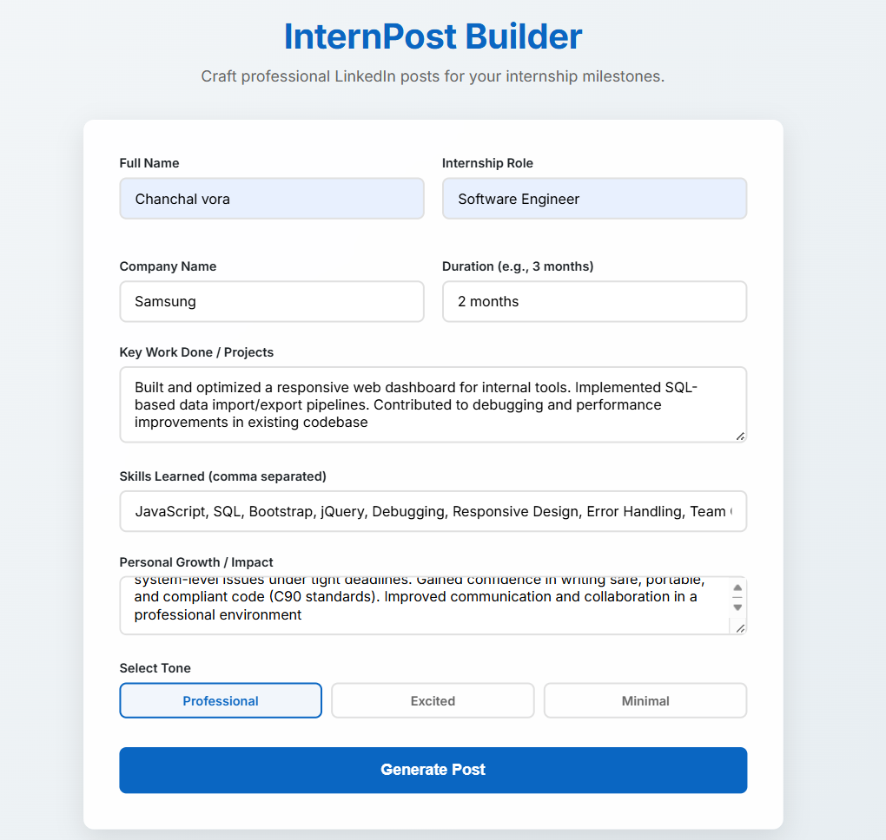
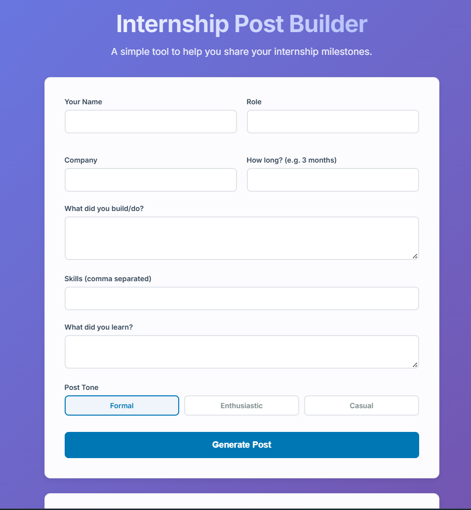
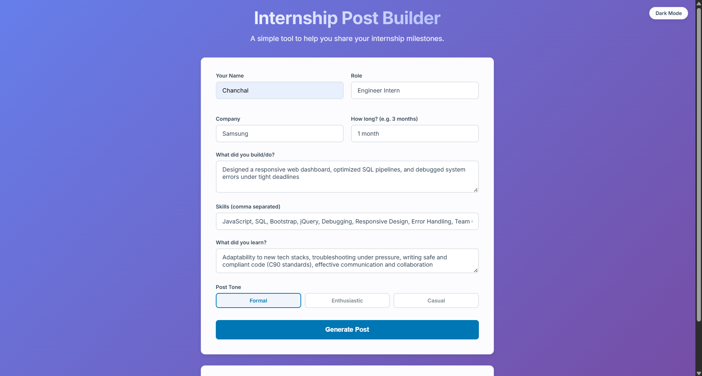
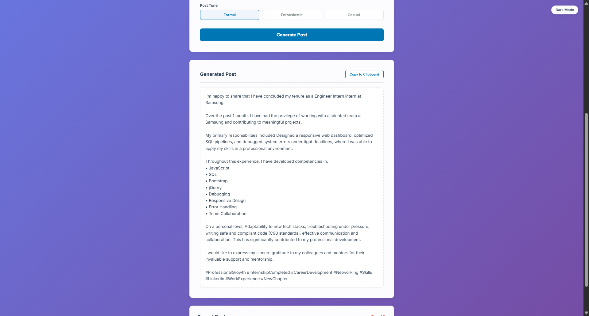
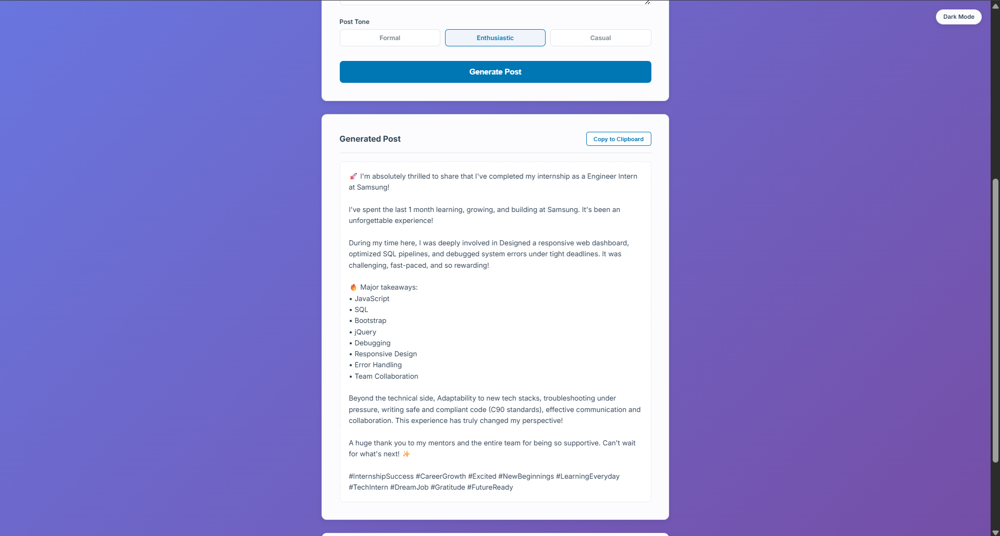
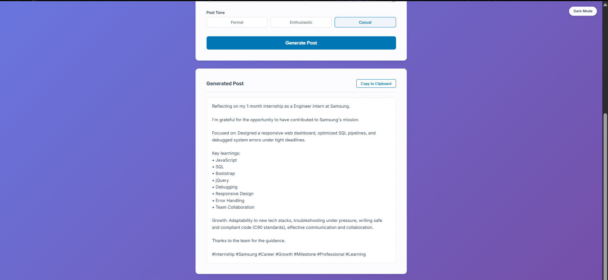
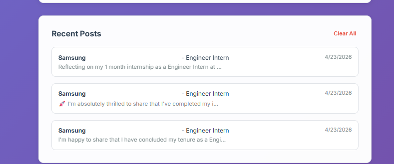

# Internship Post Builder

**Transform your internship milestones into engaging LinkedIn stories.**

[](https://www.python.org/)
[](https://flask.palletsprojects.com/)
[](https://opensource.org/licenses/MIT)

The Internship Post Builder is a developer-focused tool designed to solve the "blank page problem" for students completing their internships. By synthesizing key achievements into structured LinkedIn updates, it ensures your professional milestones are shared with the right tone and formatting.

---

## Table of Contents
- [Overview](#overview)
- [Key Features](#key-features)
- [Screenshots / Demo](#screenshots--demo)
- [Tech Stack](#tech-stack)
- [Installation & Setup](#installation--setup)
- [License](#license)

---

## Overview
Sharing internship updates on LinkedIn is a critical part of building a professional brand. This project automates that balance, transforming raw inputs into high-quality, formatted posts ready for a professional network.

---

## Screenshots / Demo

### 1. The Workspace


### 2. Form Entry


### 3. Capturing Impact


### 4. Tone Selection


### 5. Generation State


### 6. Final Output


### 7. Recent History


---

## Tech Stack
- **Backend Framework:** Flask (Python)
- **Frontend Logic:** Vanilla JavaScript
- **Styling:** Custom CSS3
- **Icons:** Lucide Icons
- **Deployment:** Render

---

## Installation & Setup

1. **Clone & Enter:**
   ```bash
   git clone https://github.com/chanchalvora11-crypto/internship-post-builder.git
   cd internship-post-builder
   ```

2. **Environment Setup:**
   ```bash
   python -m venv venv
   source venv/bin/activate  # Windows: venv\Scripts\activate
   pip install -r requirements.txt
   ```

3. **Launch:**
   ```bash
   python app.py
   ```

---

## Deployment
- **Build Command:** `pip install -r requirements.txt`
- **Start Command:** `gunicorn app:app`

---

## License
Distributed under the MIT License.

---
*Built for interns everywhere.*
